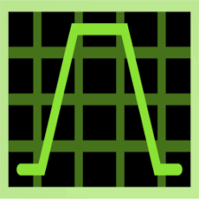

<!-- PROJECT LOGO -->
 

  

  
  

  <h3 align="center">Welcome to Verilog coding</h3>

  

   A complete verilog guide to start your journey in frontend VLSI design
     
    <a href="https://github.com/othneildrew/Best-README-Template/issues/new?labels=bug&template=bug-report---.md">Report Bug</a>
    ·
    <a href="https://github.com/othneildrew/Best-README-Template/issues/new?labels=enhancement&template=feature-request---.md">Request Feature</a>
  

<!-- TABLE OF CONTENTS -->
## DOCUMENTATION

Welcome to the documentation for Verilog coding of Sequential circuits! This guide will help you understand and navigate the resources available for this project. Whether you're a developer, user, or contributor, this documentation is designed to provide you with the information you need to get started, use the software effectively, and contribute to its development.
  

  
Table of Contents

  <ol>
    <li>
      <a href="#introduction">Introduction</a>
      <ul>
        <li><a href="#what-is-a-sequential-circuit-?">What is a sequential circuit ?</a></li>
      </ul>
      <ul>
        <li><a href="#repository-structure">Repository Structure</a></li>
      </ul>
      <ul>
        <li><a href="#built-with">Built with</a></li>
      </ul>
    </li>
    <li>
      <a href="#getting-started">Getting Started</a>
      <ul>
        <li><a href="#prerequisites">Prerequisites</a></li>
        <li><a href="#installation">Installation</a></li>
         <li><a href="#cloning-the-repository">Cloning the Repository</a></li>
         <li><a href="#directory-structure">Directory Structure</a></li>
         <li><a href="#compiling-and-simulating">Compiling and Simulating</a></li>
      </ul>
    </li>
    <li><a href="#contributing">Contributing</a></li>
    <li><a href="#license">License</a></li>
    <li><a href="#contact">Contact</a></li>
    <li><a href="#acknowledgments">Acknowledgments</a></li>
  </ol>

<!-- ABOUT THE PROJECT -->
## INTRODUCTION

👋 Welcome to the Verilog HDL Programming Repository! This repository is designed to assist individuals who are either new to Verilog or looking to refresh their knowledge of digital electronic circuits using Verilog. It aims to provide a collection of examples focused on combinational circuits to help you learn and master Verilog HDL (Hardware Description Language).

 

### What is a Sequential Circuit?

A sequential circuit is a type of electronic circuit where the output depends not only on the current inputs but also on the history of inputs. This is in contrast to combinational circuits, where the output is determined solely by the present input values.

Sequential circuits use memory elements, such as flip-flops or latches, to store information about past inputs. This means that the behavior of sequential circuits can be described by state diagrams or state tables, which show how the circuit transitions from one state to another based on input signals and current states.

### Repository Structure
This repository contains:

  * Module Code: Verilog HDL code for various combinational circuits.

  * Testbench: Testbench files for verifying the functionality of each module.

  * Schematic: Visual representation of the circuit design.

  * Simulation Waveform: Simulation results demonstrating the circuit's behavior.

 

Each design example in this repository is provided with these four components to give you a comprehensive understanding of how to create and test digital circuits in Verilog.

Feel free to explore the code, use it as a learning tool, and contribute improvements. Happy coding! :smile: 

### Built With 🔧

 

Xilinx Vivado 2020.2

 

Icarus verilog

  

 

Gtkwave

 

VS Code

<!-- GETTING STARTED -->
## Getting Started

This guide will help you get up and running with the Verilog code in this repository. Whether you’re a professional or just starting out, you’ll find everything you need to start exploring and utilizing these Verilog modules.

### Prerequisites
Before you get started, make sure you have the following tools installed:

Verilog Simulator: You'll need a Verilog simulator to compile and test the code. Some popular options include:

* Vivado Simulator
* Icarus Verilog
  
Synthesis Tool: To synthesize the Verilog code for FPGA implementation, you’ll need a synthesis tool such as:

* Xilinx Vivado
* Xilinx ISE
  
Basic Knowledge: Familiarity with Verilog HDL and FPGA design concepts is helpful, a very thorough understanding of digital electronic circuits. THis repository mainly focuses on sequential circuits. So, you need to have the basic knowledge of latches, flip-flops, registers, counters, state diagrams and state transitions.

### Installation

1. Xilinx Vivado at [AMD](https://www.amd.com/en.html)
2. Icarus verilog at [Icarus](https://bleyer.org/icarus/)
3. VS code at [VS code](https://code.visualstudio.com/Download)

### Cloning the Repository
To get a local copy of this repository, use the following command:
`git clone https://github.com/yourusername/your-repository-name.git`
Replace yourusername and your-repository-name with the appropriate values.

### Directory Structure

After cloning the repository, you’ll find the following directory structure:

your-repository-name/  
│   
├── src/              # Source code directory   
│   ├── module1.v     # Example Verilog module    
│   ├── module2.v     # Another Verilog module   
│   └── ...           # Additional Verilog files   
│   
├── test/             # Testbenches directory   
│   ├── module1_tb.v  # Testbench for module1   
│   ├── module2_tb.v  # Testbench for module2   
│   └── ...           # Additional testbenches   
│   

### Compiling and Simulating
1. Compile the Verilog source files and testbenches. The exact commands will depend on your chosen simulator. For example, using Icarus Verilog, you might run:  
    Use a text editor to place the program in a text file, hello.v, then compile this program with the command:  
    `% iverilog -o hello hello.v`  
   
   The results of this compile are placed into the file "hello", because the "-o" flag tells the compiler where to place the compiled result. Next, execute the compiled 
   program like so:  
   `% vvp hello`  

   If there are multiple modules instantiated in a file then :  
   `% iverilog -s main -o hello hello.v`
   
    
2. In Vivado, the simulation is done by : Flow navigator -> Simulation -> Behavioral simulation
   

 <!-- CONTRIBUTING -->
## Contributing

Contributions are what make the open source community such an amazing place to learn, inspire, and create. Any contributions you make are **greatly appreciated**.

If you have a suggestion that would make this better, please fork the repo and create a pull request. You can also simply open an issue with the tag "enhancement".
Don't forget to give the project a star! ⭐ Thanks again! 😄

1. Fork the Project
2. Create your Feature Branch (`git checkout -b feature/AmazingFeature`)
3. Commit your Changes (`git commit -m 'Add some AmazingFeature'`)
4. Push to the Branch (`git push origin feature/AmazingFeature`)
5. Open a Pull Request

<!-- LICENSE -->
## License

<!-- CONTACT -->
## 🔗 Contact

 

 
Email: jsuhani000710@gmail.com

<!-- ACKNOWLEDGMENTS -->
## Acknowledgments

* [Choose an Open Source License](https://choosealicense.com)
* [GitHub Emoji Cheat Sheet](https://www.webpagefx.com/tools/emoji-cheat-sheet)
* [Markdown Guide](https://www.markdownguide.org/basic-syntax/#code)
* [Img Shields](https://shields.io)
* [Icons](https://icons8.com/icons)
* [Badges](https://ileriayo.github.io/markdown-badges/)
